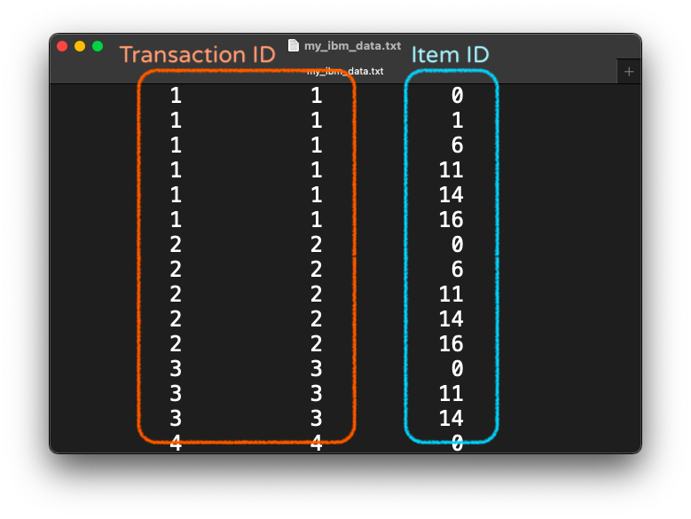

# Data Mining Project 1 Association Analysis

This is a homework of Data Mining course Fall 2022 @ NCKU

report: https://hackmd.io/@cpt/Bkeur4tss

## Algorithms Implemented

- Apriori
- FP Growth

## Getting Started

To run this program, please first `cd` to the directory of `main.py`, then use the following command:

```bash
% python3 main.py [--dataset=DATASET] [--min_sup=MIN_SUPPORT] [--min_conf=MIN_CONFIDENCE]
```

|Options|Description|
|:-:|---|
|`--dataset`|Dataset to run association analysis|
|`--min_sup`|Set minimum support (default value `0.02`) |
|`--min_conf`|Set minimum confidence (default value `0.05`) |

For example:

```bash
% python3 main.py --dataset=my_ibm_data.txt --min_sup=0.8 --min_conf=0.95
```

## Input File

This program accepts only dataset in `IBM Quest Synthetic Data Generator` format.

### `IBM Quest Synthetic Data Generator` Dataset

Values at first and second column will be used as `Transaction ID`, as for value at third column will be used as `Item ID`.

<p align=center><center>
    </center>
</p>

## Results

A `.csv` file of the result will be created in the `outputs` folder with the same name as the dataset. Minimum support and minimum confidence are also listed in the file name.
